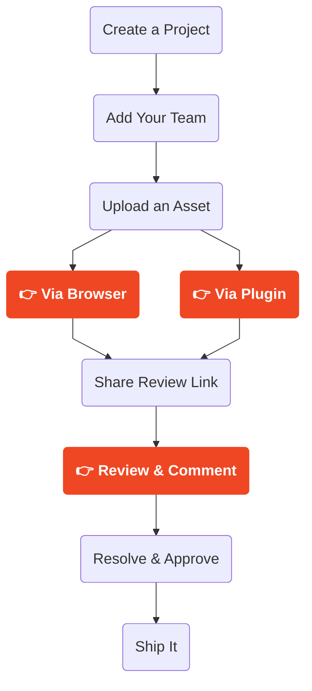

import { Card, CardGrid, LinkButton, Aside } from '@astrojs/starlight/components';

Shale is a review and approval platform for creative teams. It lets artists share 2D and 3D work with clients and collaborators through a simple browser link — no software installs, no file transfers, no lost feedback threads. From quick image markups to fully navigable 3D environments, Shale keeps feedback connected to the work it's about.

## Why Shale?

Creative projects generate a lot of content — 3D environments, renders, marketing materials, concept drawings — and getting clear feedback on all of it usually means juggling inboxes, chat threads, and vague screenshots with no clear connection between them. Shale gives you one place to get feedback on all of your project's assets. A 3D capture, a render, a concept drawing — all in the same project, all reviewable in a browser, all with notes attached to exactly what they're about.

When you connect directly from a DCC like Blender, that feedback comes back into your scene in real-time. For browser uploads it keeps everything centralised and annotatable — a much cleaner loop than the alternatives.

- **One place** to get feedback on all your project's creative work
- **Organised and accessible** to the whole team, not buried in someone's inbox
- **Annotations attached to the work**, so feedback always has context
- **No software needed** for reviewers — just a link

---

## Who is Shale for?

- **Game Studios** — review levels, assets, and environments with your team and clients without sending builds.
- **VFX Teams** — annotate renders and 3D scenes with notes tied to camera position and geometry.
- **Architects** — walk stakeholders through models and collect structured feedback remotely.
- **Interior Designers** — share spaces with contractors and clients with a clear way to leave feedback on finishes and materials.
- **Creative Professionals** — anyone who needs a better feedback loop than email screenshots and Slack threads.

---

## What is an Asset?

An **asset** is anything you upload to Shale for review — a 3D environment, a rendered image, a marketing deck, a concept drawing. It's the thing your reviewers open, look at, and leave notes on.

Shale works across two broad categories:

### 2D Assets

For many teams, Shale is simply the best way to get clear, annotated feedback on flat content — without the mess of email chains or scattered Slack messages.

- **Images** (PNG, JPG, EXR) — renders, concept art, screenshots, marketing materials
- **Drawings & Illustrations** — any visual you need marked up with precision
- **PDFs** — coming soon

Upload directly from your browser, share a link, and your reviewers annotate exactly where they mean. No 3D knowledge required on either side.

### 3D Assets & Environments

This is where Shale becomes uniquely powerful. Using the Shale plugin in Blender, you define a **capture region** over your scene — a 3D volumetric cage placed using the **Grid** or **Spline** tool. When you export, Shale captures a 360° view at every node in that volume and assembles them into a fully navigable 3D environment.

Reviewers open a link and explore it like Google Maps Street View — jumping between capture nodes, looking in any direction, getting a real sense of the space. No 3D software. No file downloads. No explanation required.

When they leave a comment, it comes back to you in Blender in real-time, placed in 3D — exactly where they meant it. The stakeholder never needed to understand 3D, and you still get every note in full spatial context.

- **3D Environments** — navigable captures from a Grid or Spline capture region
- **3D Models** (GLB/GLTF) — reviewers orbit, zoom, and annotate directly on geometry

---

## How it fits your process

You don't change how you work — Shale sits at the end of your existing pipeline and replaces the feedback step.

**As a creator**, upload from your browser or push directly from Blender via the plugin. Share a link. That's it.

**As a reviewer**, open a link and leave notes exactly where you mean them — no software, no training.

**As a team**, one source of truth: the same asset, same annotations, same approval state for everyone.

 

 

## Get started

  <LinkButton href="/02_browser_upload/overview" icon="right-arrow">Upload via Browser</LinkButton>
  <LinkButton href="/03_plugin_upload/overview" icon="right-arrow">Upload via Plugin</LinkButton>
  <LinkButton href="/04_review/overview" icon="right-arrow">Review & Comment</LinkButton>
  <LinkButton href="/01_getting_started/video-tutorials-quick-start" icon="right-arrow" variant="secondary">Video Tutorials</LinkButton>

