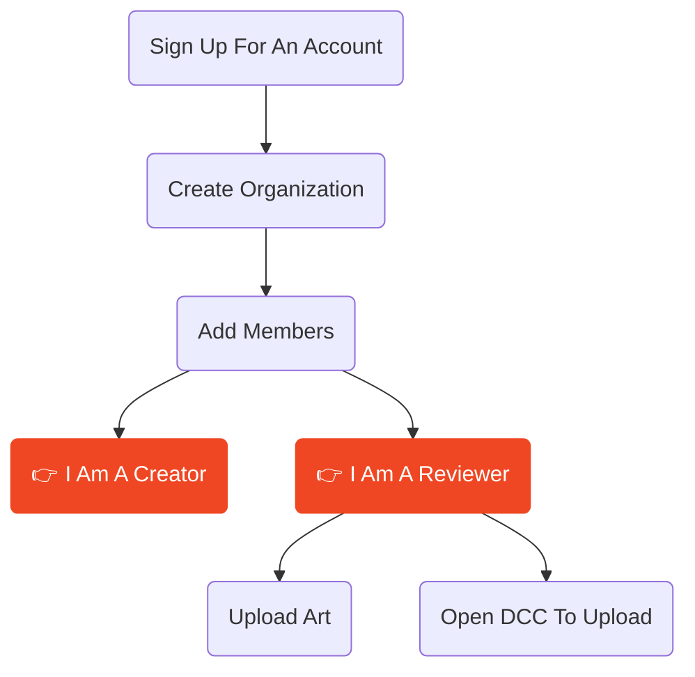

Shale is a review and approval platform built for 2D and 3D content — enabling stakeholders to give feedback directly in 3D without needing to learn complex tools, and getting that feedback back into the hands of artists in real-time.

Designed for teams across game design, architecture, VFX, interior design and architecture.

## Who is Shale for?

import { Card, CardGrid } from '@astrojs/starlight/components';

<CardGrid>
  <Card title="Creative Professionals" icon="pencil">
   Anyone creating, sharing and looking for feedback on shared documents.
  </Card>
  <Card title="Game Studios" icon="puzzle">
    Review levels, assets, and environments with your team and clients.
  </Card>
  <Card title="Architects" icon="comment">
    walk through models and collect structured feedback from stakeholder.
  </Card>
  <Card title="VFX Teams" icon="laptop">
    annotate renders and 3D scenes with context-aware notes tied to camera view.
  </Card>
  <Card title="Interior Designers" icon="sun">
  Interior Design** — share notes on photos with contractors and give clients a great way to see their new decor and leave feedback for contractors.
  </Card>
</CardGrid>

## First Steps

## Basic Process

1. Create A Project
2. Create your content in your DCC or upload existing images, content or models 
2. If in your DCC, Mark the area you want reviewed and export to the Shale App
3. Send reviewers a link to your Shale project on the app, or choose a project and asset to open and review
4. Reviewers annotate directly on a representation of the 3D environment using the brush engine and comment tools
5. Feedback flows back into your DCC as embedded comment threads with approval states
6. Iterate, resolve, and track the full chain of custody through to final sign-off

## Platforms
For reviewers - Shale runs in a browser on any device, is multi touch and stylus enabled on tablets!2
For creators - Shale is currently supports:
- Blender Direct Integration
  - Blender Direct Environment Capture
  - Blender Direct 3D models Upload
  - Blender Direct Render Upload
- 2D Images (PNG/JPG/EXR)
- 360 Images from cameras such as Insta360