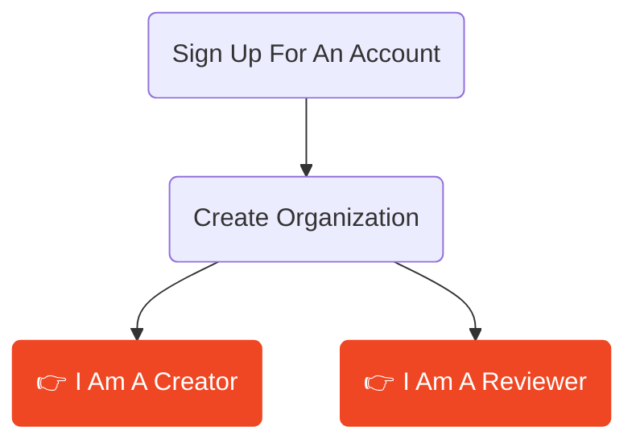

Shale is a review and approval solution designed for real-time collaboration on 3D content across industries like game design, architecture, VFX, and construction.

Speeding up creative cycles by getting notes, feedback and annotations getting directly back in the hands of the artists in real-time. 

## Who is Shale for?

import { Card, CardGrid } from '@astrojs/starlight/components';

<CardGrid>
  <Card title="Creative Professionals" icon="pencil">
   Anyone creating, sharing and looking for feedback on shared documents!.
  </Card>
  <Card title="Game Studios" icon="puzzle">
    Review levels, assets, and environments with your team and clients.
  </Card>
  <Card title="Architects" icon="comment">
    walk through models and collect structured feedback from stakeholder
  </Card>
  <Card title="VFX Teams" icon="laptop">
    annotate renders and 3D scenes with context-aware notes tied to camera view
  </Card>
  <Card title="Interior Designers" icon="sun">
  Interior Design** — share notes on photos with contractors and give clients a great way to see their new decor
  </Card>
</CardGrid>

## First Steps

## Basic Process

1. Create your content
2. Mark the area you want reviewed and export to the Shale App
3. Send reviewers a link to your Shale project on the app, or choose a project and asset to open and review
4. Reviewers annotate directly on a representation of the 3D environment using the brush engine and comment tools
5. Feedback flows back into your DCC as embedded comment threads with approval states
6. Iterate, resolve, and track the full chain of custody through to final sign-off

## Platforms

Shale runs on **Web**, **Desktop**, and is optimized for **iPad and tablets**.
