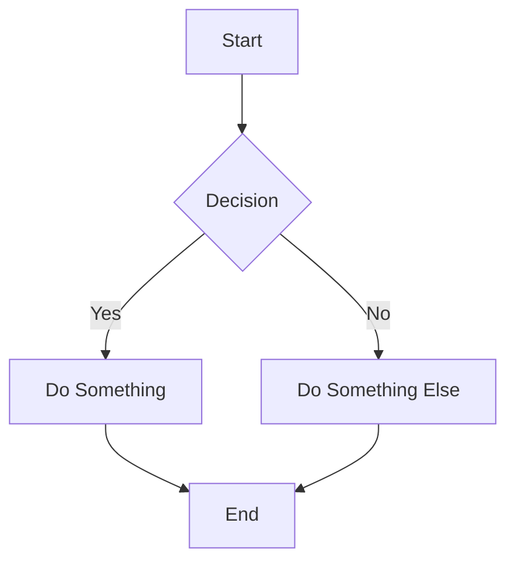
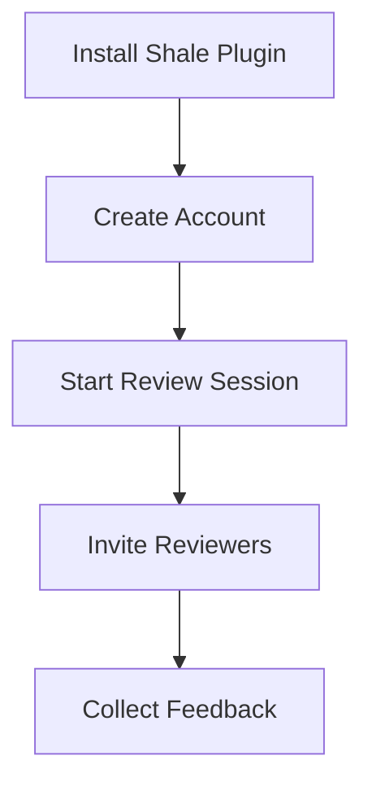
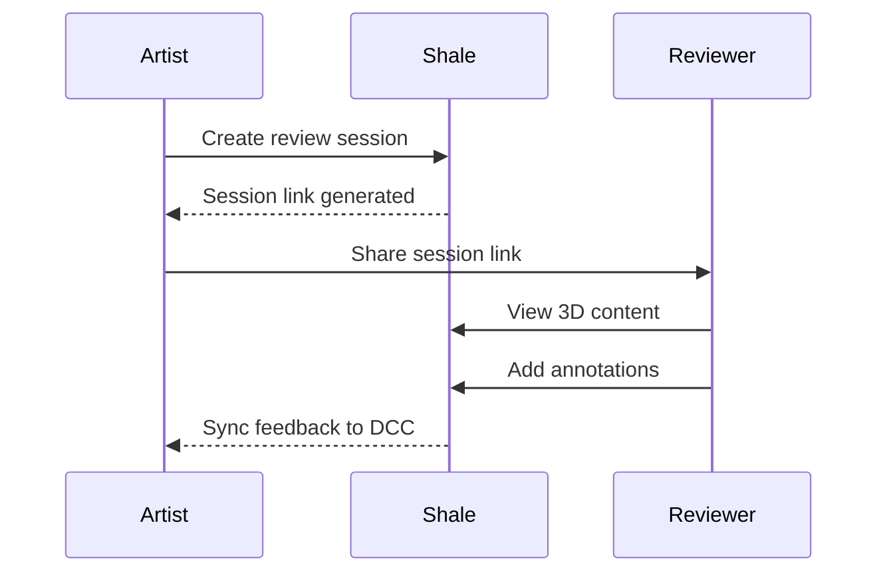
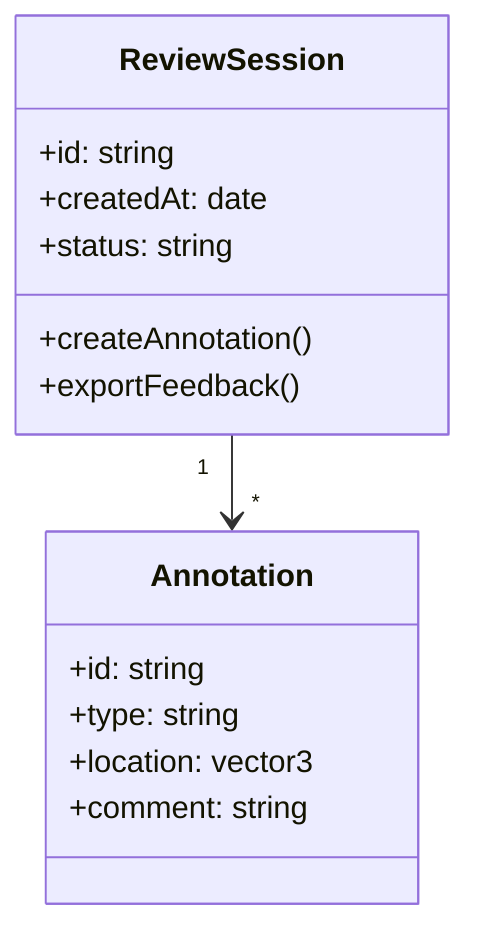
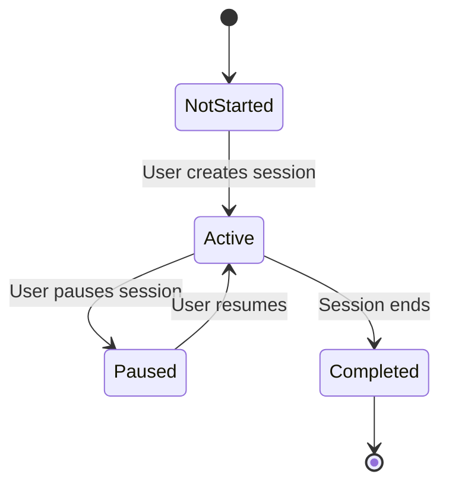
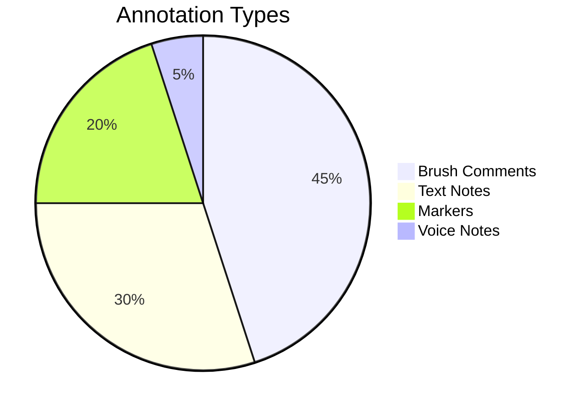
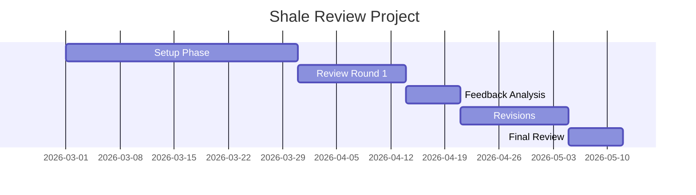
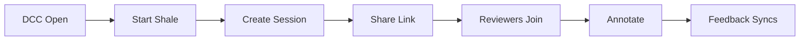
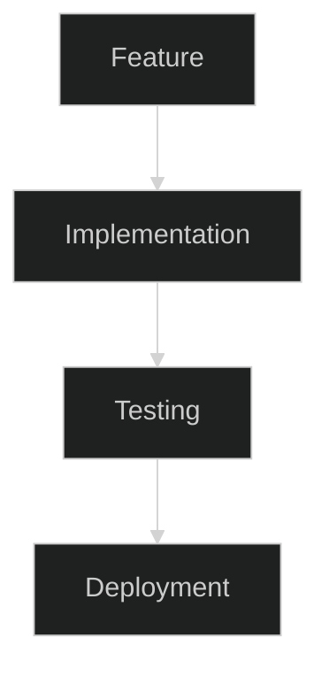
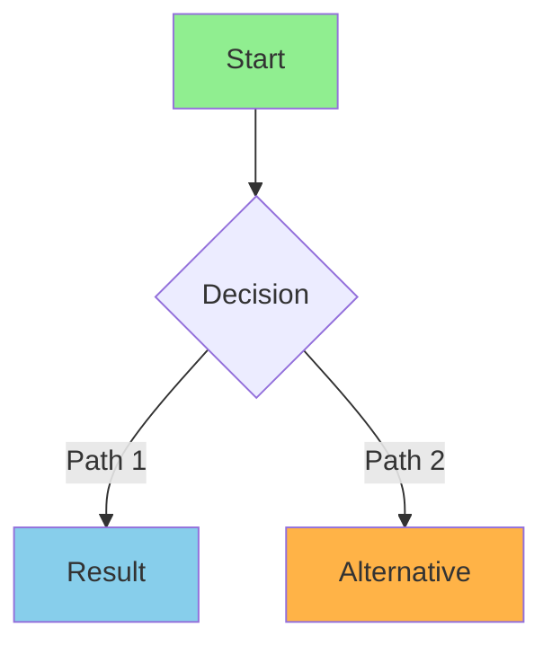

Your Shale Docs site includes the `astro-mermaid` integration, which allows you to embed interactive Mermaid diagrams directly in your Markdown files. This guide shows you how to use it.

## What is Mermaid?

Mermaid is a JavaScript-based diagramming and charting tool that lets you create diagrams using a simple, Markdown-like syntax. No need for image files or external tools—just write code and get beautiful diagrams automatically.

## Basic Syntax

To add a Mermaid diagram to any `.md` or `.mdx` file, use a code block with the `mermaid` language identifier:

````markdown

````

The diagram will render automatically when you build or view your site.

## Diagram Types

### Flowcharts

Perfect for showing processes and workflows:



### Sequence Diagrams

Show interactions between different actors:



### Class Diagrams

Document object relationships and hierarchies:



### State Diagrams

Show state transitions:



### Pie Charts

Display data distribution:



### Gantt Charts

Plan and track project timelines:



## Best Practices

### Keep Diagrams Simple
- Focus on one concept per diagram
- Limit the number of elements
- Use clear, descriptive labels

### Use Consistent Naming
- Use the same terminology as your documentation
- Match your branding and style guide
- Be consistent with capitalization

### Provide Context
- Always introduce the diagram with explanatory text
- Explain what each element represents
- Include a caption or title when needed

### Example with Context

```markdown
## Shale Review Workflow

This flowchart shows the basic steps for a typical review session:


```
```

## Styling and Customization

Mermaid supports themes and styling. You can customize diagrams by adding configuration in your Astro config, or use inline themes within code blocks:

### Using Themes



### Customizing Node Styles



## Troubleshooting

### Diagram Not Rendering

1. **Check syntax**: Ensure your Mermaid syntax is valid
2. **Verify language identifier**: Use exactly ` ```mermaid ` (not ```` ```diagram ````)
3. **Rebuild site**: Run `npm run build` to force a full rebuild
4. **Check browser console**: Look for JavaScript errors in your browser's developer tools

### Performance Considerations

- Large, complex diagrams may affect page load times
- Consider breaking complex workflows into multiple smaller diagrams
- Use simple chart types for frequently updated content

## More Resources

- [Mermaid Official Documentation](https://mermaid.js.org/)
- [Mermaid Live Editor](https://mermaid.live/) - test diagrams before adding to your docs
- [astro-mermaid Integration Docs](https://github.com/jordancknight/astro-mermaid)
